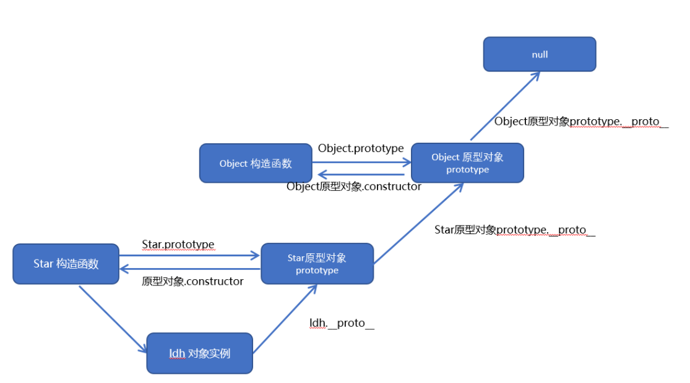

# 1. Js有哪些数据类型

JavaScript共有八种数据类型

基本数据类型： Undefined、Null、Boolean、Number、String、Symbol、BigInt。

引用数据类型：object,function,array

其中 Symbol 和 BigInt 是ES6 中新增的数据类型：

* Symbol 代表创建后独一无二且不可变的数据类型，它主要是为了解决可能出现的全局变量冲突的问题。
* BigInt 是一种数字类型的数据，它可以表示任意精度格式的整数，使用 BigInt 可以安全地存储和操作大整数，即使这个数已经超出了 Number 能够表示的安全整数范围。

# 2. 数据类型检测的方式有哪些

然后判断数据类型的方法一般可以通过：**typeof**、**instanceof**、**constructor**、**toString**四种常用方法

| 不同类型的优缺点 | typeof                                                     | instanceof                         | constructor                                 | Object.prototype.toString.call   |
| ---------------- | ---------------------------------------------------------- | ---------------------------------- | ------------------------------------------- | -------------------------------- |
| 优点             | 使用简单                                                   | 能检测出 `引用类型`              | 基本能检测所有的类型（除了null和undefined） | 检测出所有的类型                 |
| 缺点             | 只能检测出除null外的基本数据类型和引用数据类型中的function | 不能检测出基本类型，且不能跨iframe | constructor易被修改，也不能跨iframe         | IE6下，undefined和null均为Object |

# 3.null和undefined区别

* 首先 Undefined 和 Null 都是基本数据类型，这两个基本数据类型分别都只有一个值，就是 undefined 和 null。
* undefined 代表的含义是**未定义**，null 代表的含义是**空对象**。一般变量声明了但还没有定义的时候会返回 undefined，null主要用于赋值给一些可能会返回对象的变量，作为初始化。
* undefined 在 JavaScript 中不是一个保留字，这意味着可以使用 undefined 来作为一个变量名，但是这样的做法是非常危险的，它会影响对 undefined 值的判断。我们可以通过一些方法获得安全的 undefined 值，比如说 void 0。
* 当对这两种类型使用 typeof 进行判断时，Null 类型化会返回 “object”，这是一个历史遗留的问题。当使用双等号对两种类型的值进行比较时会返回 true，使用三个等号时会返回 false。

# 4.如何判断 this 的指向

* 第一种是**函数调用模式**，当一个函数不是一个对象的属性时，直接作为函数来调用时，this 指向全局对象。
* 第二种是**方法调用模式**，如果一个函数作为一个对象的方法来调用时，this 指向这个对象。
* 第三种是**构造器调用模式**，如果一个函数用 new 调用时，函数执行前会新创建一个对象，this 指向这个新创建的对象。
* 第四种是 **apply 、 call 和 bind 调用模式**，这三个方法都可以显示的指定调用函数的 this 指向。其中 apply 方法接收两个参数：一个是 this 绑定的对象，一个是参数数组。call 方法接收的参数，第一个是 this 绑定的对象，后面的其余参数是传入函数执行的参数。也就是说，在使用 call() 方法时，传递给函数的参数必须逐个列举出来。bind 方法通过传入一个对象，返回一个 this 绑定了传入对象的新函数。这个函数的 this 指向除了使用 new 时会被改变，其他情况下都不会改变。

# 5. for...in和for...of的区别

for…of 是ES6新增的遍历方式，允许遍历一个含有iterator接口的数据结构（数组、对象等）并且返回各项的值，和ES3中的for…in的区别如下

* for…of 遍历获取的是对象的键值，for…in 获取的是对象的键名；
* for… in 会遍历对象的整个原型链，性能非常差不推荐使用，而 for … of 只遍历当前对象不会遍历原型链；
* 对于数组的遍历，for…in 会返回数组中所有可枚举的属性(包括原型链上可枚举的属性)，for…of 只返回数组的下标对应的属性值；

**总结：** for...in 循环主要是为了遍历对象而生，不适用于遍历数组；for...of 循环可以用来遍历数组、类数组对象，字符串、Set、Map 以及 Generator 对象。

# 6. 数组的遍历方法有哪些

| **方法**            | **是否改变原数组** | **特点**                                                                                                              |
| ------------------------- | ------------------------ | --------------------------------------------------------------------------------------------------------------------------- |
| forEach()                 | 否                       | 数组方法，不改变原数组的长度，没有返回值                                                                                    |
| map()                     | 否                       | 数组方法，不改变原数组的长度，有返回值，可链式调用                                                                          |
| filter()                  | 否                       | 数组方法，过滤数组，返回包含符合条件的元素的数组，可链式调用                                                                |
| for...of                  | 否                       | for...of遍历具有Iterator迭代器的对象的属性，返回的是数组的元素、对象的属性值，不能遍历普通的obj对象，将异步循环变成同步循环 |
| every() 和 some()         | 否                       | 数组方法，some()只要有一个是true，便返回true；而every()只要有一个是false，便返回false.                                      |
| find() 和 findIndex()     | 否                       | 数组方法，find()返回的是第一个符合条件的值；findIndex()返回的是第一个返回条件的值的索引值                                   |
| reduce() 和 reduceRight() | 否                       | 数组方法，reduce()对数组正序操作；reduceRight()对数组逆序操作                                                               |

# 7. forEach和map方法有什么区别

这方法都是用来遍历数组的，两者区别如下：

* forEach()方法会针对每一个元素执行提供的函数，如果遍历的元素是引用数据类型，则可以改变指针指向的堆内存里的值，该方法没有返回值；
* map()方法返回一个新数组，新数组中的值为原数组调用函数处理之后的值，如果遍历的元素是引用数据类型，则可以改变指针指向的堆内存里的值

# 8. 说说你对浅拷贝和深拷贝的理解

浅拷贝：

* 浅拷贝，指的是创建新的数据，这个数据有着原始数据属性值的一份精确拷贝
* 如果属性是基本类型，拷贝的就是基本类型的值。如果属性是引用类型，拷贝的就是内存地址
* 即浅拷贝是拷贝一层，深层次的引用类型则共享内存地址

常见的浅拷贝：

* Object.assign
* Object.create
* slice
* concat()
* 展开运算符

**深拷贝**

深拷贝开辟一个新的栈，两个对象属完成相同，但是对应两个不同的地址，修改一个对象的属性，不会改变另一个对象的属性

常见的深拷贝方式有：

* _.cloneDeep()。loadsh
* jQuery.extend()
* JSON.stringify()
* 手写循环递归

# 9.什么是闭包？

* 官方说法：闭包就是指有权访问另一个函数作用域中的变量的函数。
* MDN说法：闭包是一种特殊的对象。它由两部分构成：函数，以及创建该函数的环境。环境由闭包创建时在作用域中的任何局部变量组成。

**深度回答**

浏览器在加载页面会把代码放在栈内存（ ECStack ）中执行，函数进栈执行会产生一个私有上下文（ EC ），此上下文能保护里面的使用变量（ AO ）不受外界干扰，并且如果当前执行上下文中的某些内容，被上下文以外的内容占用，当前上下文不会出栈释放，这样可以保存里面的变量和变量值，所以我认为闭包是一种保存和保护内部私有变量的机制。

# 10.闭包的作用

闭包有两个常用的用途；

* 闭包的第一个用途是使我们在函数外部能够访问到函数内部的变量。通过使用闭包，可以通过在外部调用闭包函数，从而在外部访问到函数内部的变量，可以使用这种方法来**创建私有变量**。
* 闭包的另一个用途是使已经运行结束的函数上下文中的**变量对象继续留在内存中**，因为闭包函数保留了这个变量对象的引用，所以这个变量对象不会被回收。

# 11.闭包在项目中的引用场景，以及带来的问题

在实际的项目中，会基于闭包把自己编写的模块内容包裹起来，这样编写就可以保护自己的代码是私有的，防止和全局变量或者是其他的代码冲突，这一点是利用保护机制。

但是不建议过多的使用闭包，因为使用不被释放的上下文，是占用栈内存空间的，过多的使用会导致导致内存泄漏。

解决闭包带来的内存泄漏问题的方法是：使用完闭包函数后手动释放。

# 12.闭包的使用场景

1. `return` 回一个函数
2. 函数作为参数
3. IIFE（自执行函数）
4. 循环赋值
5. 使用回调函数就是在使用闭包
6. 节流防抖
7. 函数柯里化

# 13.什么是作用域链

当在 `js`中使用一个变量的时候，首先 `js`引擎会尝试在当前作用域下去寻找该变量，如果没找到，再到它的上层作用域寻找，以此类推直到找到该变量或是已经到了全局作用域，这样的变量作用域访问的链式结构, 被称之为作用域链

**深度回答**

作用域链的本质上是一个指向变量对象的指针列表。变量对象是一个包含了执行环境中所有变量和函数的对象。作用域链的前端始终都是当前执行上下文的变量对象。全局执行上下文的变量对象（也就是全局对象）始终是作用域链的最后一个对象。

# 14.作用域链的作用

作用域链的作用是**保证对执行环境有权访问的所有变量和函数的有序访问，通过作用域链，可以访问到外层环境的变量和函数。**

# 15.说说Js中的预解析？

JS 引擎在运行一份代码的时候，会按照下面的步骤进行工作：

1.把变量的声明提升到当前作用域的最前面，只会提升声明，不会提升赋值

2.把函数的声明提升到当前作用域的最前面，只会提升声明，不会提升调用

3.先提升 function，在提升 var

# 16.变量提升与函数提升的区别？

**变量提升**

简单说就是在 JavaScript 代码执行前引擎会先进行预编译，预编译期间会将 `变量声明与函数声明`提升至其 `对应作用域的最顶端`，`函数内声明的变量`只会提升至 `该函数作用域最顶层`，`当函数内部定义的一个变量与外部相同时`，那么 `函数体内的这个变量就会被上升到最顶端`。

**函数提升**

函数提升只会提升函数声明式写法，函数表达式的写法不存在函数提升

函数提升的优先级大于变量提升的优先级，即函数提升在变量提升之上

# 17.什么是箭头函数，有什么特征

使用 "箭头" ( => ) 来定义函数. 箭头函数相当于匿名函数, 并且简化了函数定义

**箭头函数的特征:**

* 箭头函数没有this, this指向定义箭头函数所处的外部环境
* 箭头函数的this永远不会变，call、apply、bind也无法改变
* 箭头函数只能声明成**匿名函数**，但可以通过表达式的方式让箭头函数具名
* 箭头函数没有原型prototype，即不能用作为构造函数
* 箭头函数不能当做一个构造函数 因为 this 的指向问题
* 箭头函数没有 arguments 在箭头函数内部访问这个变量访问的是外部环境的arguments, 可以使用 ...代替

# 18.说说你对递归函数的理解

如果一个函数在内部调用自身本身，这个函数就是递归函数

其核心思想是把一个大型复杂的问题层层转化为一个与原问题相似的规模较小的问题来求解

一般来说，递归需要有边界条件、递归前进阶段和递归返回阶段。当边界条件不满足时，递归前进；当边界条件满足时，递归返回

**优点**：结构清晰、可读性强

**缺点**：**`<span style="color:red">`**效率低、调用栈可能会溢出****，其实每一次函数调用会在内存栈中分配空间，而每个进程的栈的容量是有限的，当调用的层次太多时，就会超出栈的容量，从而导致栈溢出。

# 19.call、apply、bind三者的异同

**共同点** :

* 都可以改变this指向;
* 三者第一个参数都是 `this`要指向的对象，如果如果没有这个参数或参数为 `undefined`或 `null`，则默认指向全局 `window`

**不同点**:

* call 和 apply 会调用函数, 并且改变函数内部this指向.
* call 和 apply传递的参数不一样,call传递参数使用逗号隔开,apply使用数组传递，且 `apply`和 `call`是一次性传入参数，而 `bind`可以分为多次传入
* `bind`是返回绑定this之后的函数

**应用场景**

1. call 经常做继承.
2. apply经常跟数组有关系. 比如借助于数学对象实现数组最大值最小值
3. bind 不调用函数,但是还想改变this指向. 比如改变定时器内部的this指向

# 20.说说面向对象的特性与特点

* 封装性
* 继承性
* 多态性

面向对象编程具有灵活、代码可复用、容易维护和开发的有点、更适合多人合作的大型软件项目

# 21.创建对象有哪几种方式？

1. 字面量的形式直接创建对象
2. 函数方法
   1. **工厂模式**，工厂模式的主要工作原理是用函数来封装创建对象的细节，从而通过调用函数来达到复用的目的。
   2. **构造函数模式**
   3. **原型模式**
   4. **构造函数模式+原型模式**，这是创建自定义类型的最常见方式。
   5. **动态原型模式**
   6. **寄生构造函数模式**
3. class创建

# 22.Array 数组对象，数组常用方法

* join() 将一个数组转成字符串。返回一个字符串
* reverse() 将数组中各元素颠倒顺序
* delete 运算符只能删除数组元素的值，而所占空间还在，总长度没变(arr.length)
* shift()删除数组中第一个元素，返回删除的那个值，并将长度减 1
* pop()删除数组中最后一个元素，返回删除的那个值，并将长度减 1
* unshift() 往数组前面添加一个或多个数组元素，长度会改变
* push() 往数组结尾添加一个或多个数组元素，长度会改变
* concat() 连接数组
* slice() 切割数组，返回数组的一部分
* splice()插入、删除或替换数组的元素
* toLocaleString() 把数组转换成局部字符串
* toString()将数组转换成一个字符串
* forEach()遍历所有元素
* every()判断所有元素是否都符合条件
* sort()对数组元素进行排序
* map()对元素重新组装，生成新数组
* filter()过滤符合条件的元素
* find() 查找 返回满足提供的测试函数的第一个元素的值。否则返回 undefined。
* some() 判断是否有一个满足条件 ，返回布尔值
* fill() 填充数组
* flat() 数组扁平化

能影响原来数组的方法         splice()       push()      pop()         shift()          unshift()      reverse()             sort() ...

不会影响原来数组的方法

    concat()      slice()       forEach()    toSting()     join()        reduce()      map()    filter()   slice()    findIndex() ...

无返回值的：

    forEach()

返回值为新数组的(js哪些数组方法会返回新内存空间--换一种问法)：

    splice()、concat()、slice()、sort()、reverse()、map()、filter()

# 23.说一下hasOwnProperty、instanceof方法

**hasOwnProperty()** 方法会返回一个布尔值，指示对象自身属性中是否具有指定的属性（也就是，是否有指定的键）。

**instanceof****运算符**用于检测构造函数的 `prototype` 属性是否出现在某个实例对象的原型链上。

# 24.什么是原型对象，说说对它的理解

**构造函数的内部的 prototype 属性指向的对象，就是构造函数的原型对象。**

原型对象包含了可以由该构造函数的所有实例共享的属性和方法。当使用构造函数新建一个实例对象后，在这个对象的内部将包含一个指针(****proto****)，这个指针指向构造函数的 原型对象，在 ES5 中这个指针被称为对象的原型。

# 25.什么是原型链

**原型链是一种查找规则**

当访问一个对象的属性时，如果这个对象内部不存在这个属性，那么它就会去它的原型对象里找这个属性，这个原型对象又会有自己的原型，于是就这样一直找下去，这种链式查找过程称之为原型链

# 26. 根据原型链的链状结构手动绘制原型链图



# 27. 原型链的终点是什么？

原型链的尽头是null。也就是**Object.prototype.**proto****

# 28.实现继承的方法

1.原型链继承

**关键：子类构造函数的原型为父类构造函数的实例对象**

**缺点**：1、子类构造函数无法向父类构造函数传参。

　　　2、所有的子类实例共享着一个原型对象，一旦原型对象的属性发生改变，所有子类的实例对象都会收影响

　　　3、如果要给子类的原型上添加方法，必须放在Son.prototype = new Father()语句后面

2.借用构造函数继承

**关键：用 .call() 和 .apply()方法,在子类构造函数中,调用父类构造函数**

**缺点**：1、只继承了父类构造函数的属性，没有继承父类原型的属性。

　　　2、无法实现函数复用，如果父类构造函数里面有一个方法，会导致每一个子类实例上面都有相同的方法。

3.组合继承

**关键：原型链继承+借用构造函数继承**

**缺点**：1、使用组合继承时，父类构造函数会被调用两次，子类实例对象与子类的原型上会有相同的方法与属性，浪费内存。

4.原型式继承

**关键：创建一个函数，将要继承的对象通过参数传递给这个函数，最终返回一个对象，它的隐式原型指向传入的对象。** (***Object.create()方法的底层就是原型式继承***)

**缺点**：只能继承父类函数原型对象上的属性和方法，无法给父类构造函数传参

5.寄生式继承

**关键：在原型式继承的函数里，给继承的对象上添加属性和方法，增强这个对象**

**缺点**：只能继承父类函数原型对象上的属性和方法，无法给父类构造函数传参

6.寄生组合继承

**关键：原型式继承 + 构造函数继承**

**Js最佳的继承方式，只调用了一次父类构造函数**

7.混入继承

**关键：利用Object.assign的方法多个父类函数的原型拷贝给子类原型**

8. class继承

**关键：class里的extends和super关键字，继承效果与寄生组合继承一样**

# 29. 什么是回调地狱？回调地狱会带来什么问题？

回调函数的层层嵌套，就叫做回调地狱。回调地狱会造成代码可复用性不强，可阅读性差，可维护性(迭代性差)，扩展性差等等问题。

# 30. Promise是什么

Promise是异步编程的一种解决方案，它是一个对象，可以获取异步操作的消息，他的出现大大改善了异步编程的困境，避免了地狱回调，它比传统的解决方案回调函数和事件更合理和更强大。

**promise本身只是一个容器,真正异步的是它的两个回调resolve()和reject()**

**promise本质 不是控制 异步代码的执行顺序（无法控制） ， 而是控制异步代码结果处理的顺序**

# 31. promise实例有哪些状态，怎么改变状态

（1）Promise的实例有**三个状态**:

* Pending（进行中）
* Resolved（已完成）
* Rejected（已拒绝）

当把一件事情交给promise时，它的状态就是Pending，任务完成了状态就变成了Resolved、没有完成失败了就变成了Rejected。

**如何改变 promise 的状态**

* resolve(value): 如果当前是 pending 就会变为 resolved
* reject(error): 如果当前是 pending 就会变为 rejected
* 抛出异常: 如果当前是 pending 就会变为 rejected

注意：一旦从进行状态变成为其他状态就永远不能更改状态了。

# 32. Promise有哪些实例方法

**then**

`then`方法可以接受两个回调函数作为参数。第一个回调函数是Promise对象的状态变为 `resolved`时调用，第二个回调函数是Promise对象的状态变为 `rejected`时调用。其中第二个参数可以省略。 `then`方法返回的是一个新的Promise实例（不是原来那个Promise实例）。因此可以采用链式写法，即 `then`方法后面再调用另一个then方法。

**catch**

该方法相当于 `then`方法的第二个参数，指向 `reject`的回调函数。不过 `catch`方法还有一个作用，就是在执行 `resolve`回调函数时，如果出现错误，抛出异常，不会停止运行，而是进入 `catch`方法中。

**finally**

`finally`方法用于指定不管 Promise 对象最后状态如何，都会执行的操作。该方法是 ES2018 引入标准的。

下面是一个例子，服务器使用 Promise 处理请求，然后使用 `finally`方法关掉服务器。

```javascript

server.listen(port)
  .then(function () {
    // ...
  })
  .finally(server.stop);
复制代码
```

`finally`方法的回调函数不接受任何参数，这意味着没有办法知道，前面的 Promise 状态到底是 `fulfilled`还是 `rejected`。这表明，`finally`方法里面的操作，应该是与状态无关的，不依赖于 Promise 的执行结果。

# 33.async 函数是什么

* 一句话概括： 它就是 Generator 函数的语法糖，也就是处理异步操作的另一种 `高级写法`

# 34. 什么是Event Loop

* 事件循环Event Loop又叫事件队列，两者是一个概念

事件循环指的是js代码所在运行环境（浏览器、nodejs）编译器的一种解析执行规则。事件循环不属于js代码本身的范畴，而是属于js编译器的范畴，在js中讨论事件循环是没有意义的。换句话说，js代码可以理解为是一个人在公司中具体做的事情， 而 事件循环 相当于是公司的一种规章制度。 两者不是一个层面的概念。

# 35.常见的宏任务与微任务分别有哪些

| 任务（代码）           | 宏/微 任务 | 环境        |
| ---------------------- | ---------- | ----------- |
|                        | 宏任务     | 浏览器      |
| 事件                   | 宏任务     | 浏览器      |
| 网络请求（Ajax）       | 宏任务     | 浏览器      |
| setTimeout() 定时器    | 宏任务     | 浏览器/Node |
| fs.readFile() 读取文件 | 宏任务     | Node        |
| Promise.then()         | 微任务     | 浏览器/Node |
| async/await            | 微任务     | 浏览器/Node |

# 36.let、const、var的区别

**（1）块级作用域：** 块作用域由 `{ }`包括，let和const具有块级作用域，var不存在块级作用域。块级作用域解决了ES5中的两个问题：

* 内层变量可能覆盖外层变量
* 用来计数的循环变量泄露为全局变量

**（2）变量提升：** var存在变量提升，let和const不存在变量提升，即在变量只能在声明之后使用，否在会报错。

**（3）给全局添加属性：** 浏览器的全局对象是window，Node的全局对象是global。var声明的变量为全局变量，并且会将该变量添加为全局对象的属性，但是let和const不会。

**（4）重复声明：** var声明变量时，可以重复声明变量，后声明的同名变量会覆盖之前声明的遍历。const和let不允许重复声明变量。

**（5）暂时性死区：** 在使用let、const命令声明变量之前，该变量都是不可用的。这在语法上，称为**暂时性死区**。使用var声明的变量不存在暂时性死区。

**（6）初始值设置：** 在变量声明时，var 和 let 可以不用设置初始值。而const声明变量必须设置初始值。

**（7）指针指向：** let和const都是ES6新增的用于创建变量的语法。 let创建的变量是可以更改指针指向（可以重新赋值）。但const声明的变量是不允许改变指针的指向。

| **区别**     | **var** | **let** | **const** |
| ------------------ | ------------- | ------------- | --------------- |
| 是否有块级作用域   | ×            | ✔️          | ✔️            |
| 是否存在变量提升   | ✔️          | ×            | ×              |
| 是否添加全局属性   | ✔️          | ×            | ×              |
| 能否重复声明变量   | ✔️          | ×            | ×              |
| 是否存在暂时性死区 | ×            | ✔️          | ✔️            |
| 是否必须设置初始值 | ×            | ×            | ✔️            |
| 能否改变指针指向   | ✔️          | ✔️          | ×              |

# 37. 什么是事件冒泡（Event Bubbling）

事件开始由最具体的元素（⽂档中嵌套层次最深的那个节点）接收到后，开始逐级向上传播到较为不具体的节点。

如果点击了上面页面代码中的 `<button>` 按钮，那么该 `click` 点击事件会沿着 DOM 树向上逐级传播，在途经的每个节点上都会发生，具体顺序如下：

1. button 元素
2. body 元素
3. html 元素
4. document 对象

# 38.什么是事件捕获（Event Capturing）

事件开始由较为不具体的节点接收后，然后开始逐级向下传播到最具体的元素上。

事件捕获的最大作用在于：事件在到达预定⽬标之前就可以捕获到它。

如果仍以上面那段 HTML 代码为例，当点击按钮后，在事件捕获的过程中，document 对象会首先接收到这个 `click` 事件，然后再沿着 DOM 树依次向下，直到 `<button>`。具体顺序如下：

1. document 对象
2. html 元素
3. body 元素
4. button 元素

# 39.什么是事件委托

事件委托，就是利用了事件冒泡的机制，在较上层位置的元素上添加一个事件监听函数，来管理该元素及其所有子孙元素上的某一类的所有事件。原理是：事件冒泡！

适用场景：在绑定大量事件的时候，可以选择事件委托

**优点**

* 事件委托可以减少事件注册数量，节省内存占⽤!
* 当新增⼦元素时，⽆需再次做事件绑定，因此非常适合动态添加元素 (vue解析模板时, 会对新创建的元素, 额外进行绑定的)

# 40. 怎么阻止事件冒泡、阻止默认事件？

**阻止事件冒泡**

e.stopPropagation()

**阻止默认事件,3种方式**

```javascript

e.preventDefault();//谷歌及IE8以上
window.event.returnValue = false; //IE8及以下
return false; //无兼容问题（但不能用于节点直接onclick绑定函数）
```

# 41. 手写深拷贝

```javascript

 function fn(obj) {
      // 判断数据是否是复杂类型
      if (obj instanceof Object) {
        //判断数据是否是数组
        if (Array.isArray(obj)) {
          //声明一个空数组来接收拷贝后的数据
          let result = []
          obj.forEach(item => {
            // 需要递归深层遍历，否则复制的是地址
            result.push(fn(item))
          })
          // 返回输出这个数组,数组拷贝完成
          return result
        } else {
          //如果是对象,就声明一个空对象来接收拷贝后的数据
          let result = {}
          for (let k in obj) {
            // 使用递归深层遍历
            result[k] = fn(obj[k])
          }
          // 返回输出这个对象,对象拷贝完成
          return result
        }
      }
      // 简单数据类型则直接返回输出
      return obj
    }
```

# 42. 使用Promise封装AJAX请求

```javascript

// promise 封装实现：
function getJSON(url) {
  // 创建一个 promise 对象
  let promise = new Promise(function(resolve, reject) {
    let xhr = new XMLHttpRequest();
    // 新建一个 http 请求
    xhr.open("GET", url, true);
    // 设置状态的监听函数
    xhr.onreadystatechange = function() {
      if (this.readyState !== 4) return;
      // 当请求成功或失败时，改变 promise 的状态
      if (this.status === 200) {
        resolve(this.response);
      } else {
        reject(new Error(this.statusText));
      }
    };
    // 设置错误监听函数
    xhr.onerror = function() {
      reject(new Error(this.statusText));
    };
    // 设置响应的数据类型
    xhr.responseType = "json";
    // 设置请求头信息
    xhr.setRequestHeader("Accept", "application/json");
    // 发送 http 请求
    xhr.send(null);
  });
  return promise;
}
```

# 43. 防抖和节流

函数防抖是指在事件被触发 n 秒后再执行回调，如果在这 n 秒内事件又被触发，则重新计时。这可以使用在一些点击请求的事件上，避免因为用户的多次点击向后端发送多次请求。

函数节流是指规定一个单位时间，在这个单位时间内，只能有一次触发事件的回调函数执行，如果在同一个单位时间内某事件被触发多次，只有一次能生效。节流可以使用在 scroll 函数的事件监听上，通过事件节流来降低事件调用的频率。

```javascript

// //防抖
function debounce(fn, date) {
  let timer  //声明接收定时器的变量
  return function (...arg) {  // 获取参数
    timer && clearTimeout(timer)  // 清空定时器
    timer = setTimeout(() => {  //  生成新的定时器
      //因为箭头函数里的this指向上层作用域的this,所以这里可以直接用this，不需要声明其他的变量来接收
      fn.apply(this, arg) // fn()
    }, date)
  }
}
//--------------------------------
// 节流
function debounce(fn, data) {
  let timer = +new Date()  // 声明初始时间
  return function (...arg) { // 获取参数
    let newTimer = +new Date()  // 获取触发事件的时间
    if (newTimer - timer >= data) {  // 时间判断,是否满足条件
      fn.apply(this, arg)  // 调用需要执行的函数,修改this值,并且传入参数
      timer = +new Date() // 重置初始时间
    }
  }
}
```

# 44. 手写 new

（1）首先创建了一个新的空对象

（2）设置原型，将对象的原型设置为函数的 prototype 对象。

（3）让函数的 this 指向这个对象，执行构造函数的代码（为这个新对象添加属性）

（4）判断函数的返回值类型，如果是值类型，返回创建的对象。如果是引用类型，就返回这个引用类型的对象。
