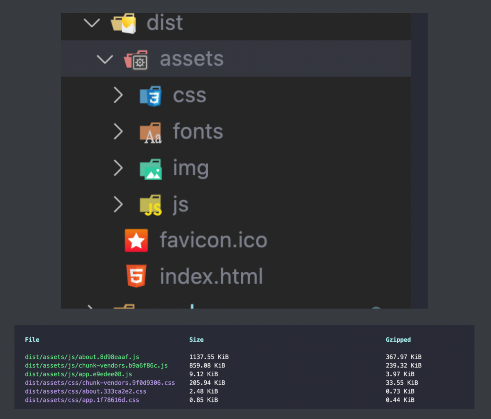
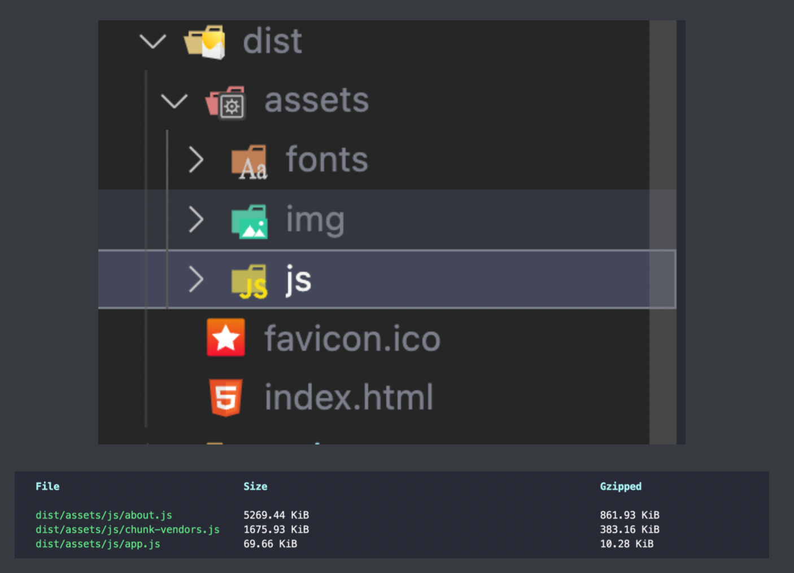

# 1. vue生命周期,父组件和子组件生命周期钩子执行顺序是什么??


```javascript

vue生命周期就是`vue实例从创建到销毁的整个过程`我们称之为vue的生命周期,通过vue的生命周期我们可以在不同的阶段进行不同的逻辑操作. vue生命周期常用的钩子函数一共有8个，分别对应的钩子函数为beforeCreate 创建前、 created创建后、beforeMount 挂载前、mounted挂载后、beforeUpdate 更新前、updated更新后、beforeDestory 销毁前、 destoryed销毁后, `页面一开始加载的时候就会触发创建前后和挂载前后的钩子函数`, 而更新的钩子函数需要当我们改变data的时候才能触发,销毁的钩子函数必须得当组件进行切换的时候就会进行销毁.在项目开发过程中,我经常使用到的钩子函数有created,我们经常`在created进行数据请求,或者获取本地存储的数据`,还有一些其他的操作. 除了created还有mounted,我们经常`在mounted里面获取dom元素` (有时候也存在获取不到dom元素的情况,这个时候我们一般用$nextTick方法来解决).

每个生命周期钩子具体发生的事情：
⑴beforeCreate(创建前)：在此生命周期函数执行的时候，data 和 methods 中的数据都还没有初始化。

⑵created(创建后)：在此生命周期函数中，data 和 methods 都已经被初始化好了，如果要调用 methods 中的方法，或者操作 data 中的数据，最早只能在 created 中操作。

⑶beforeMount(载入前)：在此生命周期函数执行的时候，模板已经在内存中编译好了，但是尚未挂载到页面中去，此时页面还是旧的。

⑷mounted(载入后)：此时页面和内存中都是最新的数据，这个钩子函数是最早可以操作 dom 节点的方法。

⑸beforeUpdate(更新前)：此时页面中显示的数据还是旧的，但是 data 中的数据是最新的，且页面并未和最新的数据同步。

⑹Updated(更新后)：此时页面显示数据和最新的 data 数据同步。

⑺beforeDestroy(销毁前)：当执行该生命周期函数的时候，实例身上所有的 data，所有的 methods 以及过滤器…等都处于可用状态，并没有真正执行销毁。

⑻destroyed(销毁后)：此时组件以及被完全销毁，实例中的所有的数据、方法、属性、过滤器…等都已经不可用了。
//下面两个钩子函数一般配合使用

⑼activated(组件激活时)：和上面的 beforeDestroy 和 destroyed 用法差不多，但是如果我们需要一个实例，在销毁后再次出现的话，用 beforeDestroy 和 destroyed 的话，就太浪费性能了。实例被激活时使用，用于重复激活一个实例的时候

⑽deactivated(组件未激活时)：实例没有被激活时。

⑾errorCaptured(错误调用)：当捕获一个来自后代组件的错误时被调用

结合实践：

**beforeCreate**：通常用于插件开发中执行一些初始化任务

**created**：组件初始化完毕，可以访问各种数据，获取接口数据等

**mounted**：dom已创建，可用于获取访问数据和dom元素；访问子组件等。

**beforeUpdate**：此时`view`层还未更新，可用于获取更新前各种状态

**updated**：完成`view`层的更新，更新后，所有状态已是最新

**beforeDestroy**：实例被销毁前调用，可用于一些定时器或订阅的取消

**destroyed**：销毁一个实例。可清理它与其它实例的连接，解绑它的全部指令及事件监听器
```

补充:

```javascript

父组件和子组件生命周期钩子执行顺序:
`加载渲染过程`:
父 beforeCreate -> 父 created -> 父 beforeMount -> 子 beforeCreate -> 子 created -> 子 beforeMount -> 子 mounted -> 父 mounted
`更新过程`:
父 beforeUpdate -> 子 beforeUpdate -> 子 updated -> 父 updated
`销毁过程`:
父 beforeDestroy -> 子 beforeDestroy -> 子 destroyed -> 父 destroyed

父组件可以监听到子组件的生命周期,使用$emit或者使用@hook:
```

# 2. vuex的理解?

```javascript

所谓的vuex其实就是vue官方给我们提供的一个`状态管理工具`,通过vuex我们可以`实现组件之间数据共享的问题`. vuex一共有5大核心,分别是`state`,里面保存的是状态,也可以理解为是数组, 接下来是`getters`,他们用来获取state里面的状态,并且可以对state的数据进行处理之后在返回,有点类似于vue的计算属性, 接下来还有`mutations`,他的作用主要是用来修改state里面的数据,不过在`mutations里面只能进行同步的操作`,还有actions,这个actions也可以去改变state的状态,不过在`actions`里面定义的方法`可以进行异步操作`,最后一个是`modules`,如果当我们的项目比较大的时候,那么保存的状态也会增加,如果都写到index.js文件里面,文件的内容就会变得特别臃肿,后期难以维护,所以我们可是使用modules进行模块化的处理,将多个状态抽离到对应js文件里面,最后在modules进行合并,这样后期就方便维护了.

如果我们要获取state里面的状态,我们可以通过`this.$store.state`来进行获取,如果要调用getters里面的方法,我们可以通过`this.$store.getters`来进行调用,如果要调用muations里面的方法我们需要使用`this,$store.commit`来触发,如果调用actions里面的方法,我们一般通过`this.$store.dispacth`来进行触发. 除了这种方式以外,我们还可以通过辅助函数的方式来进行调用和触发(`mapState, mapMutation,mapAction,mapGetters`)mapState、mapGetters在computed里调用，mapMutation,mapAction在methods里调用

在项目当中如果要改变state的状态,我们一般是在组件里面调用this.$store.dispatch方式来触发actions里面的方法,在actions里面的方法通过commit来调用mutations里面定义的方法来改变state,同时这也是vuex的执行机制

不过vuex也有一些弊端,比如浏览器刷新的时候,vuex的数据会丢失,我们一般结合本地存储来解决,当我们在mutations里面改变state的时候在通过localStorage或者sessionStorage存储到本地,然后在state的状态的属性值那块写一个三元表达式,如果本地存在数据的话则读取本地存储的数据,否则就赋值为null在项目当中我一般使用vuex会保存用户信息和token以及其他的一些状态. 以上就是我对vuex的理解.
```

# 3. vue路由有几种模式?有什么区别?原理是什么?

```javascript

vue的路由模式一共有两种,分别是哈希和history. 他们的区别是hash 就是指 url 尾巴后的#号以及后面的字符，history没有带#，外观上比hash 模式好看些.hash模式不会包含在http请求当中,并且hash不会重新加载页面,hash模式的主要原理就是`onhashchange()事件`

而使用history模式的话,如果前端的url和后端发起请求的url不一致的话,会报404错误,所以使用history模块的话我们需要和后端进行配合.

history api可以分为两大部分，切换历史状态和修改历史状态：
`修改历史状态`：包括了 HTML5 中新增的 pushState() 和 replaceState() 方法，
`切换历史状态`： 包括forward()、back()、go()三个方法
```

# 4. vue路由守卫?

```javascript

所谓的路由守卫就是当我们`进行页面跳转的时候会触发的钩子函数`,我们把它称之为vue路由守卫. vue一共给我们提供了三种路由守卫,第一种`全局路由守卫`,第二种是`组件内路由守卫`,第三种`路由独享守卫`,这个是写在路由里面. 全局路由守卫包含：beforeEach 前置守卫，beforeResolve 路由解析守卫，afterEach 后置守卫 ，组件内路由守卫：beforeRouteEnter 路由进入之前，beforeRouteUpdate 路由更新之前，beforeRouteLeave 路由离开之前，路由独享守卫：beforEnter 路由进入之前，这几个钩子函数里面都有一个回调函数,这个回调函数里面会有三个参数,分别是`to,from,next`,分别对应的是要进入的路由、离开之前的路由,以及进入写一个路由在项目中我们经常使用路由守卫实现页面的鉴权. 

比如:当用户登录之后,我们会把后台返回的token以及用户信息保存到vuex和本地,当页面进行跳转的时候,我们会在路由守卫里面获取vuex里面的token,如果token存在的话,我们则使用next让他进入要跳转的页面,如果token不存在的话我们使用next方法让他回到登录页
```

# 5. v-if与v-show的区别?

```javascript

v-if和v-show都是控制元素的显示与隐藏, 
不过v-if控制元素的显示和隐藏的时候会删除对用的dom元素,当每一个显示的时候,都会重新创建dom和渲染. 
而v-show则是通过css的`display`:none和display:block来控制元素的显示与隐藏.v-if比较耗费性能,

    所以我们涉及到`频繁的显示隐藏操作`我们建议使用`v-show`,如果不是频繁操作的话,我们可以v-if在项目中我会经常使用v-if和v-show,比如我们在搜索功能的时候,他有一个历史记录,这个时候我们根据是否有搜索的结果来判断历史记录的显示与隐藏,这块我就可以使用v-if ,当然用v-show也可以.
```

# 6. v-for与v-if的优先级那个高?如果同时使用v-for和v-if怎么解决?

```javascript

v-for的优先级高. 因为v-for的时候我们才开始渲染dom元素,这个v-if还无法进行判断.v-for和v-if不能同时使用,我们可以通过标签,比如div或者template标签来进行包裹,把v-if写到包裹的标签上面(写到v-for外面）
```

# 7. methods、computed和watch的区别?

```javascript

首先呢,methods是`用来定义方法的区域`,methods定义的方法需要调用才能触发. 不具备缓存，

- computed是计算属性；watch是监听，监听data中的数据变化。
- computed`支持缓存`，当其依赖的属性的值发生变化时，计算属性会重新计算，反之，则使用缓存中的属性值；       watch`不支持缓存`，当对应属性发生变化的时候，响应执行。
- computed`不支持异步`，有异步操作时无法监听数据变化；watch`支持异步操作`。
- computed`第一次加载时就监听`；watch默认第一次加载时不监听(immediate 组件创建时刻执行与否,
  immediate: true,第一次加载时监听（默认为false）,deep 深度监听 不推荐使用(非常的消耗性能))
- computed中的函数必须调用return；watch不是。
  使用场景：
- computed：一个属性受到多个属性影响，如：购物车商品结算。
- watch：一个数据影响多条数据，如：搜索数据。
- 数据变化响应，执行异步操作，或高性能消耗的操作，watch为最佳选择
```

# 8. vue组件通信（多说点一共有8个）? 写组件的目的是什么？要解决什么？props选项有啥作用  ?说一下组件化开发的理解?(必问)`*********`?

```javascript

1.`父传子` 在子组件的标签上定义属性 子组件通过props来进行接受,可以通过数组的方式进行接受,也可以通过对象的方式来进行接收,如果父组件没有传递属性,子组件可以default来设置默认值

2.`子传父` 子组件通过this.$emit("自定义的事件",要传给父组件的数据), 父组件通过子组件的标签监听自定义的事件,通过方法来接收传递的数据

3.`非父子组件通信`   通过中央事件总线,我们也称之为eventBus,
 我们需要创建一个空的js文件,导出这个空的vue实例
 传数据的时候 this.$bus.$emit 传
 接数据的时候是在 钩子函数 created 中 this.$bus.$on 接收 第一个参数是事件名称 第二个参数是一个回调函数   包含了要接受的数据,以上就是非父子组件通信的方式
```

补充：

```javascript

4.利用 `vuex` 进行组件通信 把公共的数据存在 vuex 里就可以实现组件之间都能使用这个数据了
5.其实` v-model` 也能实现组件通信 因为 v-model 就是 :value 和 @input 事件的合写 如果在一个子组件上使用 v-model 也能实现父子组件之间的通信
6.用`本地存储 `来 完成组件通信
7.通过`ref和refs`实现组件之间的通信
8.`.sync` 修饰符
9.`$parent和$children`
在子组件内可以直接通过$parent对父组件进行操作，在父组件内可以直接通过$children 对子组件进行操作
在父组件调用子组件时候要加下标也就是$children 是一个数组 因为可以有很多个子组件
10.`provide 和 inject`
父组件通过通过 provide 提供变量 子组件中通过 inject 注入变量，不论嵌套了几层子组件 都能通过 inject 来调用 provide 的数据
11.`$attr+$listener`
如果父组件 A 下面有子组件 B 子组件 B 下面又有子组件 C 如果 a 组件的变量和方法想要传给组件 C 的时候 就用到这个方法 适用于多级组件传值
在 B 组件中给 C 组件绑定 v-bind="$attrs" v-on="$listeners" 然后在 C 组件中就可以直接使用 a 传来的属性和方法了（简单来说：$attrs与$listeners 是两个对象，$attrs 里存放的是父组件中绑定的非 Props 属性，$listeners 里存放的是父组件中绑定的非原生事件。）

组件通信目的：传递或共享某些数据，解决组件间数据无法共享的问题
props选项作用：设置和获取标签上的属性值的
vue组件化理解：
1.组件是独立和可复用的代码组织单元。组件系统是Vue核心特性之一，它使开发者使用小型、独立和通常可复用的组件构建大型应用；
2.组件化开发能大幅`提高应用开发效率、测试性、复用性`等；
3.组件使用按分类有：页面组件、业务组件、通用组件；
4.vue的组件是基于配置的，我们通常编写的组件是组件配置而非组件，框架后续会生成其构造函数，它们基于VueComponent，扩展于Vue；
5.vue中常见组件化技术有：属性prop，自定义事件，插槽等，它们主要用于组件通信、扩展等；
6.合理的划分组件，有助于提升应用性能；
7.组件应该是高内聚、低耦合的；
8.遵循单向数据流的原则。
```

# 9. $nextTick方法有什么作用?

```javascript

$nextTick也叫做异步更新队列方法,而$nextTick方法的主要作用就是等待dom元素加载完毕之后才会执行的回调函数,我们经常会在$nextTick方法里面`获取dom元素`
比如：beforeCreated获取DOM元素、获取最新的滚动列表
```

# 10. 说一下什么是mvvm模式?

```javascript

MVVM 是Model代表数据模型，数据和业务逻辑都在Model层中定义；View代表UI视图，负责数据的展示；ViewModel负责监听Model中数据的改变并且控制视图的更新，处理用户交互操作；

View 的变化会自动更新到 ViewModel ， ViewModel 的变化也会自动同步到 View 上显示。这种自动同步是因为 ViewModel 中的属性实现了 Observer ，当属性变更时都能触发对应的操作。
```

# 11. vue双向数据绑定原理?

```javascript

vue.js 则是采用 `数据劫持` 结合 `发布者-订阅者 模式`的方式，通过 Object.defineProperty() 来劫持各个属性的 set， get ，在数据变动时发布消息给订阅者，触发相应的监听回调。这个时候就可以实现数据的双向绑定
```

```javascript

Object.defineproperty可以接收三个参数

Object.defineproperty(`obj, prop, desc`)
obj :  第一个参数就是要在哪个对象身上添加或者修改属性
prop : 第二个参数就是添加或修改的属性名
desc ： 配置项，一般是一个对象

第三个参数里面还有6个配置控住属性
writable：是否可重写 
value：  当前值
get：    读取时内部调用的函数
set：        写入时内部调用的函数
enumerable： 是否可以遍历
configurable:是否可再次修改配置项

注意：当使用了getter或setter方法，不允许使用writable和value这两个属性(如果使用，会直接报错滴)
　　get 是获取值的时候的方法，类型为 function ，获取值的时候会被调用，不设置时为undefined
　　set 是设置值的时候的方法，类型为 function ，设置值的时候会被调用，undefined
　　get或set不是必须成对出现，任写其一就可以
```

# 12. vue常用的指令有哪些?

```javascript

v-if

v-show

v-html

v-text

v-on

v-bind

v-model

v-for
```

# 13. vue常用的修饰符有哪些?

```javascript

.trim 去除首尾多余的空格

.stop 阻止事件冒泡

.once 只渲染一次

.self 事件只作用在元素本身

.number 将值转化为number类型

.capter 组件之间捕获

.prevent 阻止元素的默认行为

.native 事件穿透,让我们可以在自定义组件上定义事件和方法
```

# 14. vue如何封装可复用的组件?以及请举例说明你封装过的组件?

```javascript

1. 分析项目的所有页面结构和业务功能,抽离出相同的页面结构和业务功能

2. 在src目录下创建一个components这个的文件夹

3. 在这个文件夹内创建可复用的组件. 在需要的用的组件里面引入创建的这个可复用的组件,并进行注册,以标签的形式写在对应的地方

4. 接下来就需要对可复用的组件内容要进行封装,那么在封装的时候我们要注意组件的封闭性和开放性以及粗细粒度

5. 所谓的这个封闭性就是当我们在组件内部定义好之后外部是无法进行修改的,比如当前有一个关闭的符号,或者有一个箭头,我们需要不管任何人使用该组件时候都能够显示这个箭头,无法从外部进行修改

6. 所谓的开放性就是我们需要将动态的内容以及组件通信的方式进行数据传递,保证组件的可扩展性

7. 而所谓的粗细力度就是我们可以把一整个页面当作一个组件去进行封装,也可以一个页面包含了多个组件,至于到底选择哪种呢,这个是没有一个标准的,我们需要根据自己的业务需求去进行判断

8. 总结来说,所谓的如何封装可复用组件其实技术核心就是通过我们vue提供的组件通信在结合slot插槽来进行分装

比如:封装一个搜索框组件:

1. 在components里面创建search.vue

2. 在search.vue里面实现搜索框的布局

3. 在props里面接受 title, bgColor, size , icon,以及当点击搜索按钮或者点击回车键的时候,触发一个方法,通过this.$emit将输入框输入的值传递给父组件

4. 接下来要使用这个搜索组件,我们需要通过import 在父组件内引入子组件,并在componetns属性里面进行注册,

5. 在页面就可以使用,这个时候我们可以通过传递titile控制子组件搜索框显示的内容,通过bgcolor可以控制搜索框的背景颜色,也可以通过size设置搜索框字体的大小,也可以通过icon来设置搜索框的图标, 通过监听$emit里面定义的方法来获取搜索框输入的值
```

# 15. vue如何封装可复用的组件?以及请举例说明你封装过的组件?

```javascript

1. 分析项目的所有页面结构和业务功能,抽离出相同的页面结构和业务功能

2. 在src目录下创建一个components这个的文件夹

3. 在这个文件夹内创建可复用的组件. 在需要的用的组件里面引入创建的这个可复用的组件,并进行注册,以标签的形式写在对应的地方

4. 接下来就需要对可复用的组件内容要进行封装,那么在封装的时候我们要注意组件的封闭性和开放性以及粗细粒度

5. 所谓的这个封闭性就是当我们在组件内部定义好之后外部是无法进行修改的,比如当前有一个关闭的符号,或者有一个箭头,我们需要不管任何人使用该组件时候都能够显示这个箭头,无法从外部进行修改

6. 所谓的开放性就是我们需要将动态的内容以及组件通信的方式进行数据传递,保证组件的可扩展性

7. 而所谓的粗细力度就是我们可以把一整个页面当作一个组件去进行封装,也可以一个页面包含了多个组件,至于到底选择哪种呢,这个是没有一个标准的,我们需要根据自己的业务需求去进行判断

8. 总结来说,所谓的如何封装可复用组件其实技术核心就是通过我们vue提供的组件通信在结合slot插槽来进行分装

9. 比如:封装一个搜索框组件:

10. 在components里面创建search.vue

11. 在search.vue里面实现搜索框的布局

12. 在props里面接受 title, bgColor, size , icon,以及当点击搜索按钮或者点击回车键的时候,触发一个方法,通过this.$emit将输入框输入的值传递给父组件

13. 接下来要使用这个搜索组件,我们需要通过import 在父组件内引入子组件,并在componetns属性里面进行注册,

14. 在页面就可以使用,这个时候我们可以通过传递titile控制子组件搜索框显示的内容,通过bgcolor可以控制搜索框的背景颜色,也可以通过size设置搜索框字体的大小,也可以通过icon来设置搜索框的图标, 通过监听$emit里面定义的方法来获取搜索框输入的值
```

举例: 以dialog为例封装组件

## dialog子组件

```vue

// dialog组件(子组件)
<template>
  <div>
    <el-dialog :title="editId==-1?'添加':'编辑'" :visible.sync="dialogVisible" width="30%">
      <el-form ref="form" :model="form" label-width="80px">
        <el-form-item label="姓名">
          <el-input v-model="form.name"></el-input>
        </el-form-item>
        <el-form-item label="年龄">
          <el-input v-model="form.age"></el-input>
        </el-form-item>
      </el-form>
      <span slot="footer" class="dialog-footer">
        <el-button @click="dialogVisible = false">取 消</el-button>
        <el-button type="primary" @click="onSubmit"
          >确 定</el-button
        >
      </span>
    </el-dialog>
  </div>
</template>

<script>
export default {
  data() {
    return {
      dialogVisible: false, //对话框的显示与隐藏
      form: {
        name: "",
        age: "",
      },
      editId:0,

    };
  },
  methods: {
    info(row) {
      console.log(row.name);
      console.log(this.form.name);
      this.editId=row.id
      this.form.name=row.name
      this.form.age=row.age
      this.dialogVisible = true;
    },
    /**确定按钮 */
    onSubmit() {
      this.$emit('addEdit',this.form,this.editId)
      this.dialogVisible=false
    }
  },
  created() {},
  mounted() {},
  components: {},
  computed: {},
  watch: {},
};
</script>

<style lang='scss' scoped>
</style>
```

```vue

<template>
  <div>
    <el-button type="primary" style="margin: 50px" @click="add">添加</el-button>

    <el-table :data="list" border style="width: 45%">
      <el-table-column prop="id" label="ID" width="220"> </el-table-column>
      <el-table-column prop="name" label="姓名" width="220"> </el-table-column>
      <el-table-column prop="age" label="年龄" width="220"> </el-table-column>
      <el-table-column fixed="right" label="操作" width="100">
        <template slot-scope="scope">
          <el-button type="text" size="small">删除</el-button>
          <el-button type="text" size="small" @click="edit(scope.row)"
            >编辑</el-button
          >
        </template>
      </el-table-column>
    </el-table>

    <about ref="susu" @addEdit="addEdit"></about>
  </div>
</template>

<script>
import about from "../views/Dialog.vue";
export default {
  data() {
    return {
      list: [
        { id: 1, name: "苏苏1.0", age: 18 },
        { id: 2, name: "苏苏2.0", age: 28 },
        { id: 3, name: "苏苏3.0", age: 38 },
        { id: 4, name: "苏苏4.0", age: 48 },
        { id: 5, name: "苏苏5.0", age: 58 },
        { id: 6, name: "苏苏6.0", age: 68 },
      ],
    };
  },
  methods: {
    /**添加按钮 */
    add() {
      this.$refs.susu.info({id:-1,form:{}});
    },
    /**编辑按钮 */
    edit(row) {
      console.log(row);
      this.$refs.susu.info(row);
    },

    
    addEdit(form, editId) {
      console.log(this.list.length);
      if (editId == -1) {
        this.list.push({
          id: this.list.length + 1,
          name: form.name,
          age: form.age,
        });
      }
      else{
        this.list.forEach(i=>{
          if(i.id==editId){
            i.name=form.name
            i.age=form.age
          }
        })
      }
      console.log(form);
    },
  },
  created() {},
  mounted() {},
  components: { about },
  computed: {},
  watch: {},
};
</script>

<style lang='scss' scoped>
</style>

```

**总结**: 以dialog为例,封装可复用组件

```

       1. 调用dialog组件,入参需要绑定添加函数,通过ref控制子组件弹框的显隐
       2. 关闭dialog弹框的时候,需要子组件触发父组件方法,通知父组件修改和调用其他方法
```

# 16. vue中key的作用是什么?

避免dom元素重复渲染. 我们一般在设置key的时候首先尽量会设置为id,或者index下标

```javascript

1.在v-if中使用key
首先我们先看在vue中出现的一种情况，我们在vue中如果使用v-if进行切换时，此时Vue为了更加高效的渲染，此时会进行前后比较，如果切换前后都存在的元素，则直接复用。如果我们在模板中切换前后都存在input框，此时我们在input框中写入一些数据，并且进行页面切换，则原有的数据就会保存。
此时我们就可以使用key，给每一个input框，添加一个唯一的标识key，来表示元素的唯一性。
1.在v-for中使用key
对于用v-for渲染的列表数据来说，数据量可能一般很庞大，而且我们经常还要对这个数据进行一些增删改操作。那么整个列表都要重新进行渲染一遍，那样就会很费事。而key的出现就尽可能的回避这个问题，提高效率。v-for默认使用就地复用的策略，列表数据修改的时候，他会根据key值去判断某一个值是否修改，如果修改则重新渲染该项，否则复用之前的元素。在v-for中我们的key一般为id，也就是唯一的值，但是一般不要使用index作为key。

为什么不建议用index作为key?
使用index 作为 key和没写基本上没区别，因为不管数组的顺序怎么颠倒，index 都是 0, 1, 2...这样排列，导致 Vue 会复用错误的旧子节点，做很多额外的工作。
```

# 17. 说一下你对keep-alive的理解?以及在项目中如何使用?

```javascript

keep-alive是vue内置的一个组件，而这个组件的作用就是能够缓存不活动的组件，我们能够知道，一般情况下，组件进行切换的时候，默认会进行销毁，如果有需求，某个组件切换后不进行销毁，而是保存之前的状态，比如：说刚刚填好的表单数据。那么就可以利用keep-alive来实现。在搭建 vue 项目时，有某些路由组件没必要多次渲染，所以需要将组件在内存中进行‘持久化’，此时在router-view上使用keep-alive。 keep-alive可以使被包含的路由组件状态维持不变，即便是组件切换了，其内的状态依旧维持在内存之中。在下一次显示时，也不会重新渲染。

include - 字符串或正则表达式。只有名称匹配的组件会被缓存。

exclude - 字符串或正则表达式。任何名称匹配的组件都不会被缓存。

max-数字最多可以缓存多少组件。
```

# 18. 说一下什么是vue过滤器? 有几种?项目中如何使用,请举例说明?

```javascript

所谓的vue过滤器就是将数据进行二次处理,得到我们想要的结果数据

vue的过滤器分为两种,第一种是全局过滤器,通过vue.filter来进行定义,第二种是局部过滤器,需要定义在组件内部项目中我们通过过滤器将后台返回的状态0 和1 转化为支付或者未支付
```

# 19. 说一下你对slot插槽的理解?

```javascript

首先呢,所谓的插槽就是一个占位符,`将自定义组件的内容展示出来`.我们知道自定义的组件里面如果写内容的话,页面是不会显示出来的,如果我们想让自定义组件里面的内容显示出来,我们就需要使用slot的插槽.

●`默认插槽`：又名匿名插槽，当slot没有指定name属性值的时候一个默认显示插槽，一个组件内只有有一个匿名插槽。
●`具名插槽`：带有具体名字的插槽，也就是带有name属性的slot，一个组件可以出现多个具名插槽。
●`作用域插槽`：默认插槽、具名插槽的一个变体，可以是匿名插槽，也可以是具名插槽，该插槽的不同点是在子组件渲染作用域插槽时，可以将子组件内部的数据传递给父组件，让父组件根据子组件的传递过来的数据决定如何渲染该插槽。
```

# 20. 说一下vue中本地跨域如何解决?线上跨域如何解决?之前前后端分离跨域怎么实现? 第一个请求超时了怎么解决？同时向服务器发送六个请求，但是第一个请求发送成功后，剩余的请求就不需要了，怎么实现？如何保证前端调用接口的安全性？

```javascript

本地跨域是通过在`vue.config.js`文件里面的`devServer`属性里面的`proxy`属性里面配置,一共配置三个属性,分别是`代理名称 代理地址 开启跨域 重写路径`,
线上跨域是在`nginx.config`文件里面配置, 代理名称是通过`location` 代理名称。`proxy_pass` 代理地址
```

补充：

```javascript

取消请求：`cancelToken`方法
如何保证前端接口的安全性：
1、Token授权认证，防止未授权用户获取数据； 
2、时间戳超时机制； 
3、URL签名，防止请求参数被篡改； 
4、防重放，防止接口被第二次请求，防采集； 
5、采用HTTPS通信协议，防止数据明文传输；
```

# 21. 说一下如何对axios进行二次封装?以及api如何封装?

```javascript

1. 在src文件夹内创建utils文件夹

2. 在utils文件夹内创建request.js文件

3. 在request.js内引入axios

4. 使用axios.create方法创建axios的实例,在axios.create方法里面可以配置请求的公共地址和

超时时间以及其他的一些配置

5. 创建请求拦截器和响应拦截器

6. 在请求拦截器里面可以获取vuex的token,并通过config.header.token = vuex的token,将

token发送给后台

7. 在请求拦截器里面我们配置loading加载

8. 在响应拦截器里面我们可以结束loading加载以及token的过期处理,以及错误响应信息的处理

9. 最后通过export default 导出axios的实例对象

10. 在src文件内创建api文件夹

11. 在api文件夹内创建对应模块的js文件

12. 在对应的文件里面引入request.js文件

13. 封装api方法

14. 最后通过export default 导出封装的api方法
```

# 22. 说一下axios的拦截器的作用?应用场景都有哪些?

```javascript

首先呢,axios拦截器是axios给我们提供的两个方法,通过这两个方法我们可以对请求发送之前以及响应之后进行逻辑的再次处理(拦截). 这两个拦截器不需要手动触发,只要发送http请求的时候就会自动触发.

我在项目中经常通过拦截器发送token, 对token进行过期处理,以及进行其他的一些操作
//响应拦截
axios.interceptors.response.use(function(response){
//对响应数据做点什么
   return response.data
},function(error){
//对错误响应做点什么
  return Promise.reject(error)
})

//请求拦截
axios.interceptors.request.use(function(config){
//在发送请求之前做些什么
return config
},function(error){
//对请求错误做些什么
return Promise.reject(error)
})

我在项目中经常通过拦截器发送token, 对token进行过期处理,以及进行其他的一些操作
```

# 23. 说一下vue和jquery的区别?

```javascript

首先呢jquery他是用js封装的一个类库,主要是为了方便操作dom元素,而vue他是一个框架,并且呢,他会从真实dom构建出一个虚拟的dom树,通过diff算法渲染只发生改变的dom元素,其他的相同的dom元素不用在重新渲染. 而使用jquery去改变dom元素的时候,即使有相同的dom元素也会重新渲染,`vue是操作数据的，而jQuery是操作dom的`
```

# 24. vue中data发生变化,视图不更新如何解决?

```

因为Vue实例中的数据是响应式的而我们新增的属性并不是响应式的，由于受现在JavaScript的限制，Vue无法检测到属性的新增或删除。所以有时无法实时的更新到视图上。所以我在项目中遇到这类问题的时候一般是通过this.$set方法去解决. this.$set方法一共有三个参数,分别是目前属性,新增属性,新增的值
```

补充:

```javascript

this.$set可以使得新添加的属性也是响应式的，并触发视图更新,解决数据改变视图不更新问题
```

# 25. 为什么vue中data必须是一个函数?

```javascript

如果data是一个函数的话，这样每复用一次组件，就会返回一份新的data，类似于给每个组件实例创建一个私有的数据空间，让各个组件实例维护各自的数据。而单纯的写成对象形式，就使得所有组件实例共用了一份data，就会造成一个变了全都会变的结果。所以说vue组件的data必须是函数。这都是因为js的特性带来的，跟vue本身设计无关。
```

# 26. 发送ajax到后端请求数据的过程 , 有哪些必须要设置的参数?

```javascript
s
`options` ：只有一个参数，要求是JSON格式的数据，其可以设置如下属性：

`async` ：是否异步，true代表异步，false代表同步。默认为true

`cache `：是否缓存，true代表缓存，false代表不缓存，默认为true

`complete` ：当Ajax状态码为4时所触发的回调函数

`contentType` ：请求头，如果是POST请求，此参数为application/x-www-form-urlencoded

`data` : 发送Ajax请求时所传递的参数，要求是一个字符串

`dataType` ：期待的返回值类型，可以是text/xml/json数据类型

`success` ：当Ajax状态码为4且响应状态码为200时所触发的回调函数

`type` ：发送的http请求，可以是get，也可以是post

`url` ：请求的url地址
```

# 27. props设置默认值? props自定义验证函数? default设置对象和普通字符串写法有啥区别  (必问) `***`

```javascript

设置默认值：default
自定义验证函数：validator
设置普通字符串: default:String,
设置对象: default:()=>{}   
```

# 28. vue项目是打包了一个js文件，一个css文件，还是有多个文件？

```javascript

vue项目打包是将多个文件合并一个js文件和一个css文件
```

线上打包:  将js,css,img,fonts单独打成各自文件夹,并且实现代码压缩,打包后的体积比线下环境小



线下打包(dev环境): 没有打包css文件,只是将img,fonts打包出来,并且体积特别大



# 29. vue-cli 工程常用的 npm 命令有哪些?

```javascript

1. npm install：下载 node_modules 资源包的命令

2. npm run dev： 启动 vue-cli 开发环境的 npm命令

3. npm run serve： 启动 vue-cli 开发环境的 npm命令

4. npm run build： vue-cli 生成 生产环境部署资源 的 npm命令

5. npm run build--report： 用于查看 vue-cli 生产环境部署资源文件大小的 npm命令
```

# 30. vue 中使用了哪些设计模式？订阅者--发布者模式?(90%)  观察者模式、 订阅者模式 `**`

```javascript

vue 中使用了哪些设计模式？
1.`单例模式`：确保一个类只有一个实例对象，并提供一个全局访问点供其访问。
优点：适用于单一对象，只生成一个对象实例，避免频繁创建和销毁实例，减少内存占用。
缺点：不适用动态扩展对象。
场景：登录浮窗、Vue中的axios实例（我们对axios进行请求拦截和响应拦截，多次调用封装好的axios但是仅设置一次，封装好的axios导出就是一个单例）、全局态管理 store、线程池、全局缓存
  function Person (name, age) {
    this.name = name
    this.age = age
    this.info = function () {
      console.log(`我的名字叫${this.name}, 我今年${this.age}了`)
    }
  }
  Person.getInstance = function (name, age) {
    if (!this.instance) {
      this.instance = new Person(name, age)
    }
    console.log(this.instance)
    return this.instance
  }
  let b1 = Person.getInstance('单例1', 18)
  let b2 = Person.getInstance('单例2', 18)
  b1.info()
  b2.info()

2.`工厂模式`：工厂模式是用来创建对象最常见的一种设计模式。不必暴露构造函数的具体逻辑，而是将逻辑封装在一个个函数之中，那么这个构造函数就可以被看做工厂。
场景： 有构造函数的地方，写了大量的构造函数代码，调用了大量的new操作符。
优点：通过工厂模式，我们可以快速创建大量相似对象，没有重复代码。
缺点：工厂模式创建的对象属于Object，无法区分对象类型，这也是工厂模式没有广泛使用的原因。
function Factory (name, age) {
   this.name = name;
   this.age = age;
   // 或者
   // let obj = {}
   // obj.name = name
   // obj.age = age
   // return obj
 }
 Factory.prototype.say = function () {
   console.log(`我的名字叫${this.name}, 我今年${this.age}了`)
 }
 let zs = new Factory('张三', 18);
 let ls = new Factory('李四', 20);
 zs.say()
 ls.say()

3.`装饰器模式`（切面编程AOP）： 在不改变对象自身的基础上，在程序运行期间给对象动态的添加职责；若直接修改函数体，则违背了’开放封闭原则’，也违背了我们的’单一职责原则’；简单的说就是允许向现有的函数添加新的功能，同时不改变其结构。
场景： vue中的表单验证与表单提交就运用了这种模式，遵循封闭开放原则。
function before (fn, callback) {
    let _this = this;
    return function () {
      callback.apply(this, arguments)
      return fn.bind(this, arguments)
    }
  }

  function after (fn, callback) {
    let _this = this 
    return function () {
      let res = fn.apply(this, arguments)
      callback.apply(this, arguments)
      return res
    }
  }
  // before和after是两个高阶函数，让我们一起回忆一下什么是高阶函数？
  // 还知道call，apply,bind的区别吗
  let getName = function getName () {
    // 加入这是你同事写的烂代码，看不下去的那种，那么别动他的代码
    console.log('这是getName函数')
  }

  before(getName, function () {
    // 这个就是你要写的新逻辑
    console.log('切入前代码')
  })()

  after(getName, function () {
    // 这个也是你要写的新逻辑
    console.log('切入后代码')
  })()

4.`策略模式`： 就是定义一系列的算法，把他们一个个封装起来，并且使他们可以相互替换。
let strategy = {
    'A': function (bonus) {
      return bonus * 4
    },
    'B': function (bonus) {
      return bonus * 3
    }
  }

  function fn (level, bonus) {
    return strategy[level](bonus)
  }

  let result = fn('A', 4000)
  console.log(result, 'result')
  // 策略模式提供了开放-封闭原则，将算法或者方法封装在一个类中，使它们易于切换，易于替换。

  function func (a, b) {
    let f = function f() {
      return a + b
    }
    return f
  }

5.`发布订阅者模式`：发布订阅者模式一种一对多的依赖关系，当一个对象的状态发生改变时，所有依赖于它的对象都得将得到通知；观察者模式则是一种一对一的依赖关系。

```

```javascript

观察者模式和订阅者模式：
`两者区别`：
订阅-发布是观察者模式的一个变种。
观察者模式中主体和观察者是互相感知的，发布-订阅模式是借助第三方来实现调度的，发布者和订阅者之间互不感知
订阅-发布，观察者只有订阅了才能接受到被观察者的消息，同时观察者还可以取消接受被观察者的消息，也就是说在观察者和被观察者之间存在-个经纪人Broker来管理观察者和被观察者。

`从表面上看`:
观察者模式里，只有两个角色一一 观察者+被观察者
而发布订阅模式里，却不仅仅只有发布者和订阅者两个角色，还有一个经常被我们忽略的一一经纪人Broker

`往更深层次讲`:
观察者和被观察者，是松耦合的关系
发布者和订阅者，则完全不存在耦合

`从使用层面上讲`
观察者模式，多用于单个应用内部
发布订阅模式，则更多的是一种跨应用的模式(cross-application pattern)，比如消息中间件
```

# 31. 你都做过哪些 Vue 的性能优化？

```javascript

一、`编码优化`:
1.不要将所有的数据都放在data中，data中的数据都会增加getter和setter，会收集对应的 watcher，这样就会降低性能。
2. vue 在 v-for 时给每项元素绑定事件需要用事件代理，节约性能。
3. 单页面采用keep-alive缓存组件。
4.尽可能拆分组件，来提高复用性、增加代码的可维护性，减少不必要的渲染。因为组件粒度最细，改组件的数组，它只会渲染当前的组件。
5. v-if 当值为false时内部指令不会执行，具有阻断功能，很多情况下使用v-if替代v-show，合理使用if和show。
6. key 保证唯一性，不要使用索引 ( vue 中diff算法会采用就地复用策略)。
7. data中的所以数据都会被劫持，所以将数据尽可能扁平化，如果数据只是用来渲染可以使用Object.freeze，可以将数据冻结起来，这样就不会增加getter和setter。
8.合理使用路由懒加载、异步组件。
9.尽量采用runtime运行时版本。
10.数据持久化的问题，使用防抖、节流进行优化，尽可能的少执行和不执行。

二、`加载性能`：
1.使用第三方插件实现按需加载( babel-plugin-component )
2.滚动到可视区域动态加载 ( https://tangbc.github.io/vue-virtual-scroll-list )
3.图片懒加载 (https://github.com/hilongjw/vue-lazyload.git)
4.路由懒加载
5.cdn加速
               

三、`用户体验`：
1.app-skeleton 骨架屏
2.app-shell app壳
3.pwa 可以实现H5的离线缓存，使用servicewor
        

四、`SEO 优化`：
1.预渲染插件 prerender-spa-plugin，可以把我们代码提前运行起来，最后将代码保存下来，缺陷就是不实时。
2.服务端渲染 ssr

五、`打包优化`：
1.使用 cdn 的方式加载第三方模块
2.多线程打包 happypack
3.抽离公共文件 splitChunks
4.sourceMap 生成

六、`缓存和压缩`：
1.客户端缓存、服务端缓存
2.服务端 gzip 压缩

```

# 32. vue路由传参方式？

```javascript

一、`params传参`
this.$router.push({ 
name:"admin",　　　　
//这里的params是一个对象，id是属性名，item.id是值(可以从当前组件或者Vue实例上直接取) 
params:{id:item.id} 
}) 
//这个组件对应的路由配置 
{　　
//组件路径 
path: '/admin',　　
//组件别名 
name: 'admin',　　
//组件名 
component: Admin, 
} 
通过params传递参数，如果我们想获取 id 的参数值，可以通过this.$route.params.id这种方式来打印出来就可以得到了；

注意：获取参数的时候是 $route，跳转和传参的时候是 $router

二、`路由属性配置传参：`
this.$router.push({
name:"/admin/${item.id}", 
}) 
//这个组件对应的路由配置 
{ 　　
//组件路径 
path: '/admin:id', 　　
//组件别名 
name: 'admin', 　　
//组件名 
component: Admin, 
}

通过路由属性配置传参我们可以用this.$route.params.id来获取到 id 的值，

注意 this. $router.push 方法里面路径带的是值，路由配置项那里带的是变量名(属性名)来实现的对应；

以上两种传参方式基本上可以理解为 ajax 中的 post 请求方式，参数都是不可见的，但是上面两种方法都有一个弊端，就是当页面刷新了是获取不到参数值的，那么有没有一种方法是页面刷新之后参数依然存在呢？

三、`query传参`
this.$router.push({ 
name:"/admin",　　　　 
query:{id：item.id} 
}) 
//这个组件对应的路由配置 
{ 　　
//组件路径 
path: '/admin', 　　
//组件别名 
name: 'admin', 　　
//组件名 
component: Admin, 
}
第三种方式是用 query 来传参，这种方式是可以解决页面刷新参数消失问题的，这种方式可以理解为是 ajax 中的 get 方法，参数是直接在 url 后面添加的，参数是可见的，所以解决页面刷新参数消失问题建议使用此方法来解决；

`区别`
（1）params传参
只能用 name，不能用 path。
地址栏不显示参数名称 id，但是有参数的值。

（2）query传参
name 和 path 都能用。用 path 的时候，提供的 path 值必须是相对于根路径的相对路径，而不是相对于父路由的相对路径，否则无法成功访问。
地址栏显示参数格式为?id=0&code=1

```

# 33. Vue事件穿透的方法?

```javascript

.native 事件穿透,让我们可以在⾃定义组件上定义事件和⽅法
```

# 34. v-text v-html 区别?

```javascript

1.v-text：会把标签转义输出。即原模原样输出，h1标签没效果
2.v-html：会直接输出结果。即h1标签会出效果
```

# 35. vue中路由跳转方式?

```javascript

1.`router-link`
<router-link :to="{path:'/home'}"> 不带参数
<router-link :to="{name:'home', params: {id:1}}">  带参数
<router-link :to="{name:'home', query: {id:1}}"> 带参数

2.`this.$router.push()` (函数里面调用)
this.$router.push('/home') 不带参数
this.$router.push({path:'/home'})不带参数
this.$router.push({path:'/home',query: {id:'1'}})带参数
this.$router.push({name:'home',params: {id:'1'}}) 带参数

3.`this.$router.replace()` (用法同push)

4.`this.$router.go(n)`
向前或者向后跳转n个页面，n可为正整数或负整数

区别：

this.$router.push 跳转到指定url路径，并向history栈中添加一个记录，点击后退会返回到上一个页面
this.$router.replace 跳转到指定url路径，但是history栈中不会有记录，点击返回会跳转到上上个页面 (就是直接替换了当前页面)
this.$router.go(n) 向前或者向后跳转n个页面，n可为正整数或负整数
```

# 36. vue中加载应用太多加载慢，是什么导致的? 如何解决? 路由懒加载? component实现懒加载的原理(必问)

```javascript

1、使用 vue-router 懒加载解决首次加载时资源过多导致的速度缓慢问题
2、使用CDN加速
3、组件按需加载
4、图片资源压缩
5、对引用多次的文件进行处理，对大的文件进行分隔
6、nginx开启gzip
```

# 37. Vue2.0和3.0区别?

```javascript

1. `双向数据绑定原理发生了改变`，使用 proxy 替换 Object.defineProerty,使用 Proxy 的优势：
    可直接监听数组类型的数据变化
    监听的目标为对象本身，不需要像 Object.defineProperty 一样遍历每个属性，有一定的性能提升
    可直接实现对象属性的新增/删除
2. `默认使用懒加载`
   在 2.x 版本里。不管数据多大，都会在一开始就为其创建观察者，在数据很大时，就会造成性能的问题。在 3.x 中，只会对渲染出来的数据创建观察者，而且 3.x 的观察者更高效。
3. `生命周期有了一定的区别`
   Vue2--------------vue3
   beforeCreate -> setup() 开始创建组件之前，创建的是 data 和 method
   created -> setup()
   beforeMount -> onBeforeMount 组件挂载到节点上之前执行的函数。
   mounted -> onMounted 组件挂载完成后执行的函数
   beforeUpdate -> onBeforeUpdate 组件更新之前执行的函数。
   updated -> onUpdated 组件更新完成之后执行的函数。
   beforeDestroy -> onBeforeUnmount 组件挂载到节点上之前执行的函数。
   destroyed -> onUnmounted 组件卸载之前执行的函数。
   activated -> onActivated 组件卸载完成后执行的函数
   deactivated -> onDeactivated
4. `选项api改为组合api ` 
5. `v-if 和v-for优先级不一样了`，vue2是v-for优先级更高，vue3是v-if优先级更高
6. `插槽不一样了`，vue2中可以直接使用slot，vue3 必须使用v-slot
7. `vue3没有过滤器了`
8. `支持碎片化`，可以有多个根节点
```

### 38. element-ui中table中的列表，表头主要有哪些功能?element中table列表表头主要支持那些功能？表格组件有那些方法吗

```javascript

表头主要有哪些功能：`固定表头、筛选、排序、多级表头、多选`
方法：
clearSelection    用于多选表格，清空用户的选择
toggleRowSelection用于多选表格，切换某一行的选中状态，如果使用了第二个参数，则是设置这一行选中与否
toggleAllSelection用于多选表格，切换所有行的选中状态
toggleRowExpansion用于可展开表格与树形表格，切换某一行的展开状态，如果使用了第二个参数，则是设置这一行展开与否
setCurrentRow用于单选表格，设定某一行为选中行，如果调用时不加参数，则会取消目前高亮行的选中状态。
clearSort用于清空排序条件，数据会恢复成未排序的状态
clearFilter不传入参数时用于清空所有过滤条件，数据会恢复成未过滤的状态，也可传入由columnKey组成的数组以清除指定列的过滤条件
doLayout对 Table 进行重新布局。当 Table 或其祖先元素由隐藏切换为显示时，可能需要调用此方法—
sort    手动对 Table 进行排序。参数prop属性指定排序列，order指定排序顺序。
```

### 39. 图片的上传下载有封装过组件吗? 上传用哪种方式？编码上传用什么方法？

```javascript

1.`云储存`      
主要步骤
向后端发送请求，获取OSS配置数据
文件上传，调用OSS提供接口
文件上传完成，后的文件存储在服务器上的路径
将返回的路径存值到表单对象中

2.`传统文件服务器上传图片`
主要步骤
设置服务器上传路径、上传文件字段名、header、data参数等
上传成功后，返回服务器存储的路径
返回的图片路径存储到表单提交对象中

3.`使用<input type="file" />``
```

### 40. 页面鉴权怎么分配权限? <动态添加路由表>添加和获取动态路由?怎么做权限管理(rbac)? 按钮鉴权是怎么处理的？ 路由权限? 菜单权限? 数据权限?做后台管理系统，权限管理是怎么做的，有哪几个方面

```javascript

`页面鉴权的实现思路`:
当用户登录成功时,我们会将后台返回的token保存到vuex和本地,并且跳转到主页,这时我们会触发vue•router给我们提供的路由守卫方法,在路由守卫方法里面我们会先获取vuex或者本地存储的token,如果
token存在的话则通过next进入主页,如果token不存在的话,则通过next方法跳转到登录页面
/**
* 有token
* 可以进入非登录页面* 、 不能在进入登录页面
* 没有token
* 只能进入登录页面或者401/404
* **/
import router from "./router/index.js"
import store from "./store/index.js"
// 白名单
const whiteList = ['/login',"/404","/401"]
router.beforeEach((to, from, next) => {
if (store.getters.token) {
   if (to.path === '/login') {
      next('/')
   } else {
      next()
   }
} else {
   if(whiteList.indexOf(to.path) > -1){
      next()
   }else{
      next("/login")
   }
}
})

`菜单权限`:
   菜单的数据一般是当我们登录成功之后,后台会给我们返回token以及用户相关信息,其中用户信息这块会包含菜单的数据、路由的数据、按钮权限的数据. 我们需要将这些数据存储到vuex和本地.接下来我们需要在主页组件中获取到vuex里面所存储到的菜单数据,利用 el-menu 将菜单的数据进行动态渲染
   1.我们菜单的数据是后台根据不同的用户登录给前台返回不同的菜单数据,所谓前台只需要做到将菜单的数据渲染出来就行,至于这个用户拥有哪些菜单数据完全是由后台来决定的
   2.菜单的数据不是后端来返回,而是前端通过动态路由表来生成菜单的数据. 具体实现思路是通过this.$router.options.routes获取到完整的路由表,然后在封装一个递归方法,过滤出菜单所需要的数据,最后在通过el-menu渲染成菜单

`路由权限`:
    所谓的路由权限指的是项目中的路由数据不是写死的,而是通过后台返回的路由权限数据进行动态渲染的. 如果用户在浏览器地址访问了不存在的路由,我们则跳转到404页面
实现思路
1. 当用户登录的时候,调用getPermissionList接口获取到后台所返回的路由表数据
2. 定义一个递归方法,将后台所返回的路由表数据过滤成路由所需要的数据
3. 在通过router.addRoutes动态的添加到路由表当中

`按钮权限`:
   所谓的按钮权限是指在某个菜单的界面中， 我们需要根据按钮权限数据， 展示出可进行操作的按钮，比如删除， 修改，增加等按钮.
如何实现按钮的权限控制?
1. 如果要实现按钮的权限控制,我们需要使用vue的自定义指令去实现:
   首先需要创建一个按钮权限控制的指令,我们定义这个指令的名称为: `v-permission`
2. 在这个指令的内部获取到vuex里面存储的按钮权限数据
3. 在通过binding.value获取到自定义制定属性值的数据
4. 判断从vuex里面获取到的按钮权限数据是否包含了自定义指令包含的权限
5. 如果不包含,我们在设置el.style.display = “none”,并且使用
el.parentNode.removeChild(el)删除当前按钮元素

`具体实现代码`:
Vue.directive('permission', {
beforeMount: function (el, binding) {
let actionList = storage.getItem('actionList');
let value = binding.value;
let hasPermission = actionList.includes(value)
if (!hasPermission) {
el.style = 'display:none';
setTimeout(() => {
el.parentNode.removeChild(el);
}, 0)
}
}
})

 `接口权限`:
    所谓的接口权限其实指的是当用户在未登录时无法请求到登录以后才当请求的接口, 如果为登录时直接请求,后台会返回401.如果要实现接口权限校验,我们需要登录以后将后台所返回的token保存到vuex和本地, 在axios请求拦截器中使用config.header.token = token 或者config.header.Authorization = token 的方式将token使用请求头发送给后台
```

# 41. 封装axios的时候一般做什么工作 ? axios是怎么封装的？请求拦截和响应拦截器都是干什么的？ 简单解释下axios? promise与axios的关系 (必问)

```javascript
Axios是一个基于promise 的 HTTP 库，可以用于浏览器和 node.js，Axios（相比于原生的XMLHttpRequest对象来说） 简单易用,（相比于jQuery）axios包尺寸小且提供了易于扩展的接口，是专注于网络请求的库。

vue封装axios可以提高代码质量、让使用更为便利。axios的API很友好，开发者完全可以很轻松地在项目中直接使用；不过随着项目规模增大，如果每发起一次HTTP请求，需要写一遍设置超时时间、设置请求头、错误处理等等操作。这种重复劳动不仅浪费时间，而且让代码变得冗余不堪，难以维护；为了提高我们的代码质量，应该在项目中二次封装一下axios再使用，这样可以让使用更为便利。

1.请求拦截器的作用是在请求发送前进行一些操作，例如在每个请求体里加上token，统一做了处理如果以后要改也非常容易。
关于拦截，这里只说原理，前端的请求，最终还是离不开 ajax，像vue 的 vue-resource 、axios，都只是对ajax进行了统一的封装，它暴露出来的拦截器，其实就是写了一个方法，把ajax写在这个方法里面，（我们先说请求拦截器）在执行这个方法的时候，先将请求时要添加给请求头的那些数据（token、后端要的加密码…具体要看实际情况）先执行一遍，都赋值给一个变量，然后再统一传给ajax，接下来就是执行ajax，这就是所谓的请求拦截，其实就是先执行要添加的数据，然后再执行ajax，如果把这个添加数据的过程抽出来，就成了所谓的请求拦截器；

2、响应拦截器：
响应拦截器的作用是在接收到响应后进行一些操作，例如在服务器返回登录状态失效，需要重新登录的时候，跳转到登录页。
响应拦截器也是一样如此，就是在请求结果返回后，先不直接导出，而是先对响应码等等进行处理，处理好后再导出给页面，如果将这个对响应码的处理过程抽出来，就成了所谓的响应拦截器；

aixos封装：
1. 在src文件夹内创建utils文件夹
2. 在utils文件夹内创建request.js文件
3. 在request.js内引入axios
4. 使用axios.create方法创建axios的实例,在axios.create方法里面可以配置请求的公共地址和
超时时间以及其他的一些配置
5. 在创建请求拦截器和响应拦截器
6. 在请求拦截器里面可以获取vuex的token,并通过config.header.token = vuex的token,将
token发送给后台
7. 在请求拦截器里面我们配置loading加载
8. 在响应拦截器里面我们可以结束loading加载以及token的过期处理,以及错误响应信息的处理
9. 最后通过export default 导出axios的实例对象
10. 在src文件内创建api文件夹
11. 在api文件夹内创建对应模块的js文件
12. 在对应的文件里面引入request.js文件
13. 封装api方法
14. 最后通过export default 导出封装的api方法
```

# 42. 如果想深度修改 element-ui 样式？怎么修改样式 ？ 如果修改样式不生效，怎么处理？

```javascript
1.`新建全局样式表`
新建global.css全局样式文件，并在main,js中进行引用，在全局样式下的样式会覆盖vue中单页面中element-ui样式。
2.`在当前vue页面下新建style标签`
在当前style下不要使用scoped属性，在写有scoped属性不会覆盖element-ui样式
3.`使用/deep/进行深度修改样式`
找到需要修改的样式的标签名的类名，在类名前加/deep/,这种方式可以强制修改element-ui样式，，可直接用到加了scoped属性的style节点下。
```

# 43. 小程序的双向数据绑定跟vue的双向数据绑定的区别?

```javascript

在vue中进行数据绑定后,当数据修改了会直接更新到视图上
但是在小程序中呢,data数据修改是不会直接同步到,必须调用this.setData()这个方法
```

# 44. vue是怎么操作dom节点的？

```javascript

1.javascript 操作 dom 语法
document.getElementById("btn");
2.vue 自带的 ref 属性 操作 dom 语法
```

# 45. diff算法是什么？

```javascript

diff 算法就是对虚拟 dom 进行对比，并返回一个 patch 对象，这个对象的作用是存储两个节点不同的地方，最后用 patch 里记录的信息去局部更新真实的 dom

diff 算法的步骤
1.js 对象表示真实的 dom 结构，就是我们说的生成一个虚拟 dom，再用虚拟 dom 构建一个真的 dom 树，放到页面中。 2.状态改变的时候生成一个新的虚拟 dom 跟旧的进行对比，这个对比的过程就是 diff 算法，通过 patch 对象记录差异 3.把记录的差异用在第一个虚拟 dom 构建的真实的 dom 上，视图就更新了

Vue 的 diff 算法是平级⽐较，不考虑跨级⽐较的情况。内部采⽤深度递归的⽅式+双指针⽅式⽐较
```

# 46. vue有哪些内置组件？

```javascript
component          动态组件

transition         动画

transition-group   动画

keep - alive       缓存

slot               插槽
```

# 47. 常用vue的组件库有哪些?

```javascript
Vant Element-UI Element-UI-PLUS Boostrap Echarts Swiper 富文本编辑器
```

# 48. cookie和localStorage、sessionStorage的区别

```javascript
在html5没有出现之前,我们浏览器存储数据的⽅式⼀般都是采⽤cookie,cookie具有`过期时间`,到达指定的时间cookie就会消失,并且⼀个域名下最多只能存储20条cookie,并且cookie的⼤⼩有⼀定的限制,最后可`存储4kb`，cookie会参与到与服务端的通信中，一般会`携带在http请求的头部中`，例如一些关键密匙验证等。
⽽localstorage和sessionstorage都是html5新增的两个api⽅法,localStorage和sessionStorage是单纯的前端存储，`不参与与服务端的通信`，localstroage也称之为数据持久化,当我们使⽤localstorage将数据存储到本地的时候,如果不在浏览器上⼿动清楚或者不调⽤clear或者removeitem⽅法他是不会⾃动清楚的.
⽽sessionstorage我们称之为会话存储,使⽤sessionstorage存储的数据再关闭当前⻚⾯之后就会消失他们和cookie最⼤的区别是 cookie有过期时间,⽽本地存储的两个⽅法如果不⼿动清除或者关闭浏览器就会⼀直存储,并且本地存储的api使⽤起来更加简洁和⽅便
```

# 48. session和cookie的区别,以及cookie和localStorage、sessionStorage的区别

```
由于HTTP协议是无状态的协议，所以服务端需要记录用户的状态时，就需要用某种机制来识具体的用户，这个机制就是Session.典型的场景比如购物车，当你点击下单按钮时，由于HTTP协议无状态，所以并不知道是哪个用户操作的，所以服务端要为特定的用户创建了特定的Session，用用于标识这个用户，并且跟踪用户，这样才知道购物车里面有几本书。这个Session是保存在服务端的，有一个唯一标识。在服务端保存Session的方法很多，内存、数据库、文件都有。集群的时候也要考虑Session的转移，在大型的网站，一般会有专门的Session服务器集群，用来保存用户会话，这个时候 Session 信息都是放在内存的，使用一些缓存服务比如Memcached之类的来放 Session。2. 思考一下服务端如何识别特定的客户？这个时候Cookie就登场了。每次HTTP请求的时候，客户端都会发送相应的Cookie信息到服务端。实际上大多数的应用都是用 Cookie 来实现Session跟踪的，第一次创建Session的时候，服务端会在HTTP协议中告诉客户端，需要在 Cookie 里面记录一个Session ID，以后每次请求把这个会话ID发送到服务器，我就知道你是谁了。有人问，如果客户端的浏览器禁用了 Cookie 怎么办？一般这种情况下，会使用一种叫做URL重写的技术来进行会话跟踪，即每次HTTP交互，URL后面都会被附加上一个诸如 sid=xxxxx 这样的参数，服务端据此来识别用户。3. Cookie其实还可以用在一些方便用户的场景下，设想你某次登陆过一个网站，下次登录的时候不想再次输入账号了，怎么办？这个信息可以写到Cookie里面，访问网站的时候，网站页面的脚本可以读取这个信息，就自动帮你把用户名给填了，能够方便一下用户。这也是Cookie名称的由来，给用户的一点甜头。所以，总结一下：Session是在服务端保存的一个数据结构，用来跟踪用户的状态，这个数据可以保存在集群、数据库、文件中；Cookie是客户端保存用户信息的一种机制，用来记录用户的一些信息，也是实现Session的一种方式。 
不要混淆 session 和 session 实现。本来 session 是一个抽象概念，开发者为了实现中断和继续等操作，将 user agent 和 server 之间一对一的交互，抽象为“会话”，进而衍生出“会话状态”，也就是 session 的概念。 而 cookie 是一个实际存在的东西，http 协议中定义在 header 中的字段。可以认为是 session 的一种后端无状态实现。而我们今天常说的 “session”，是为了绕开 cookie 的各种限制，通常借助 cookie 本身和后端存储实现的，一种更高级的会话状态实现。所以 cookie 和 session，你可以认为是同一层次的概念，也可以认为是不同层次的概念。具体到实现，session 因为 session id 的存在，通常要借助 cookie 实现，但这并非必要，只能说是通用性较好的一种实现方案。

在html5没有出现之前,我们浏览器存储数据的⽅式⼀般都是采⽤cookie,cookie具有`过期时间`,到达指定的时间cookie就会消失,并且⼀个域名下最多只能存储20条cookie,并且cookie的⼤⼩有⼀定的限制,最后可`存储4kb`，cookie会参与到与服务端的通信中，一般会`携带在http请求的头部中`，例如一些关键密匙验证等。
⽽localstorage和sessionstorage都是html5新增的两个api⽅法,localStorage和sessionStorage是单纯的前端存储，`不参与与服务端的通信`，localstroage也称之为数据持久化,当我们使⽤localstorage将数据存储到本地的时候,如果不在浏览器上⼿动清楚或者不调⽤clear或者removeitem⽅法他是不会⾃动清楚的.
⽽sessionstorage我们称之为会话存储,使⽤sessionstorage存储的数据再关闭当前⻚⾯之后就会消失他们和cookie最⼤的区别是 cookie有过期时间,⽽本地存储的两个⽅法如果不⼿动清除或者关闭浏览器就会⼀直存储,并且本地存储的api使⽤起来更加简洁和⽅便

总结: 存储⼤⼩：cookie 数据⼤⼩不能超过 4k；sessionStorage 和 localStorage 虽然也有存储⼤⼩的限制，但⽐ cookie ⼤得多，可以达到5M或更⼤

    有效时间：localStorage 存储持久数据，浏览器关闭后数据不丢失除⾮主动删除数据；
sessionStorage 数据在当前浏览器窗⼝关闭后⾃动删除；cookie设置的 cookie 过期时间之前⼀直有效，即使窗⼝或浏览器关闭,
session依赖于名为JSESSIONID的Cookie，而Cookie JSESSIONID的过期时间默许为–1，只需关闭了浏览器（一次会话结束），该Session就会失效。

    数据与服务器之间的交互⽅式：cookie 的数据会⾃动的传递到服务器，服务器端也可以写cookie 到客户端；Session保存在服务端
sessionStorage 和 localStorage 不会⾃动把数据发给服务器，仅在本地保存

     存取方式的不同：Cookie中保存的是字符串，Session保存的是对象

     安全性（隐私策略）的不同 ：Cookie存储在浏览器中，对客户端是可见的，客户端的一些程序可能会窥探、
复制以至修正Cookie中的内容。而Session存储在服务器上，对客户端是透明的，不存在敏感信息泄露的风险

     对服务器造成的压力不同 ：Cookie保管在客户端，不占用服务器资源。假如并发阅读的用户十分多，Cookie是很好的选择。
Session是保管在服务器端的，每个用户都会产生一个Session。假如并发访问的用户十分多，会产生十分多的Session，耗费大量的内存。

     跨域支持上的不同:Cookie支持跨域名访问，例如将domain属性设置为“.baidu.com”，则以“.baidu.com”为后缀的一切域名均能够访问该Cookie。跨域名Cookie如今被普遍用在网络中。
而Session则不会支持跨域名访问。Session仅在他所在的域名内有效


```

# 49. 怎么在vue中使用bootstrap?

```javascript

1.下载Bootstrap
npm install bootstrap-vue
2.引入BootStrap
在 mian.js 页面,
import 'bootstrap'
import 'bootstrap/dist/css/bootstrap.min.css'
import 'bootstrap/dist/js/bootstrap.min.js'
```

# 50. vue长列表优化?


```javascript
一、原因
当页面dom元素太多时浏览器渲染速度就会变慢，当浏览器内存不足时甚至会导致浏览器卡顿或者卡死等现象。因此对症下药，解决方案就是减少页面dom的渲染。

二、原理
可以通过按需进行加载dom，即只显示可视化区域的数量。从而减少dom的结构，实现性能提升。因此，分页加载、懒加载等方案根本治标不治本。

三、实现
此文章基于vue-virtual-scroll-list第三方插件，通过虚拟列表进行滚动加载数据。

// 安装
npm i vue-virtual-scroll-list --save

<virtualList
        style="height: calc(100vh - 100px); overflow-y: auto;border:1px solid"
        :size='50'
        :keeps='15'
        :data-key="'id'"
        :data-sources="data"
        :data-component="itemComponent"
        :extra-props="{
            itemClick
        }"
    >
    </virtualList>
```
